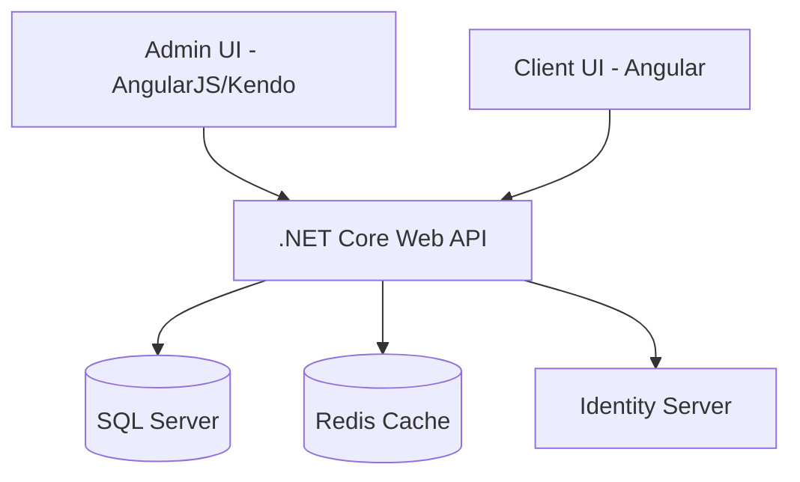
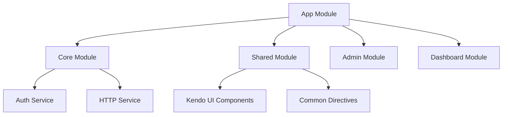
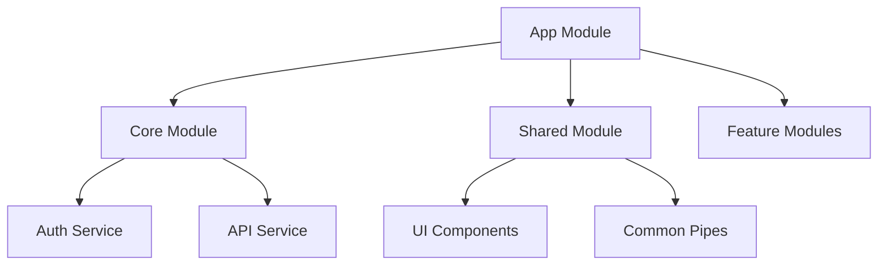
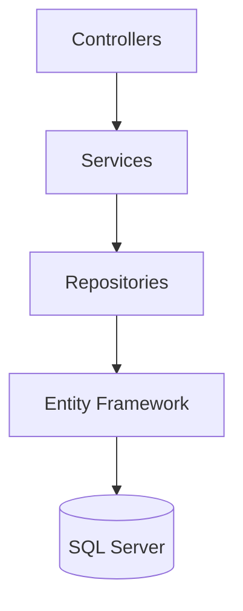
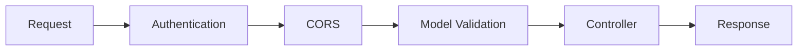

# System Patterns

## Kiến trúc tổng thể

## Admin Interface Architecture
### Core Patterns
- Module-based organization
- Controllers và Services pattern
- Kendo UI components
- Dependency Injection
- Two-way data binding

### Component Structure

## Client Interface Architecture
### Core Patterns
- Feature-based module organization
- Smart/Dumb component pattern
- Lazy loading modules
- Interceptors for HTTP requests
- Guards for route protection

### Component Structure

## Backend Architecture
### API Structure

### Middleware Chain

## Design Patterns
### Admin Interface
- MVC Pattern với AngularJS
- Service Pattern
- Factory Pattern
- Dependency Injection
- Observer Pattern với $scope

### Client Interface
- Component Pattern
- Repository Pattern
- Dependency Injection
- Observable Pattern với RxJS
- Strategy Pattern

### Backend
- Repository Pattern
- Unit of Work Pattern
- CQRS (nếu cần)
- Factory Pattern
- Strategy Pattern

## Security Patterns
- ASP.NET Core Identity
- JWT Authentication
- Role-based Access Control
- SQL Parameters
- Cross-Site Scripting Prevention
- CSRF Protection

## Testing Patterns
### Admin Interface
- Unit Testing với Jasmine
- E2E Testing với Protractor
- Service Testing
- Controller Testing

### Client Interface
- Component Testing
- Service Testing
- E2E Testing với Cypress
- Integration Testing

### Backend
- Unit Testing với xUnit
- Integration Testing
- Repository Testing
- Service Testing
- Controller Testing 